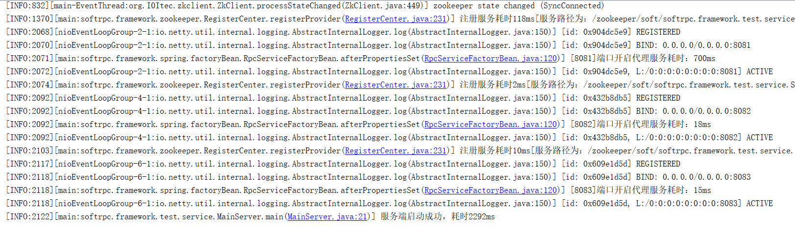

# Soft-RPC使用文档

​		Soft-RPC是一种基本功能完整的RPC框架的实现，供学习交流使用，也可以基于此方案进行二次开发，结合业务需要实现个性化RPC框架的研究和定制。

​		Email: xctian@zju.edu.cn

## 简介

​		Soft-RPC是一种轻量级的RPC框架实现方案，并未达到商用水准，但它具备RPC框架所需的核心功能，实现过程涉及**Netty、Zookeeper、Spring、JUC包下某些类的使用、序列化与反序列化、负载均衡算法、并发编程、网络编程、IO**、**设计模式**等后台开发技能领域，非常适合作为一个学习分布式服务框架、远程过程调用原理等内容的参考项目。以下简要介绍Soft-RPC的功能组成和特性：

### 配置文件

-  使用自定义配置标签，支持高度自定义、可优化
- 【soft-rpc.properties】进行全局配置，如zk超时时间，线程池大小等；【rpc-reference.xml】利用自定义标签进行服务消费者的相关参数配置；【rpc-service.xml】利用自定义标签进行服务提供者相关参数配置
- 大部分配置项支持默认配置和容错配置

### 集成Spring

- 集成Spring，支持“一键启动”：服务端只需要在启动类中加载“rpc-service.xml"文件生成ApplicationContext实例即可将启动服务；客户端只需要在启动类中加载“rpc-reference.xml"文件即可完成客户端初始化
- 将项目打包至本地仓库，即可直接当RPC框架进行使用

### 序列化/反序列化方案

- 支持三种序列化/反序列化协议：JDK原生序列化、ProtoStuff、Hessian，并且支持使用者自行配置
- 支持客户端和服务端从上述协议中自由选择序列化协议
- 为解决TCP传输过程中的粘包、半包问题，对消息进行简单的数据格式定义：消息头+消息体。其中消息头由2个int类型变量组成，分别表示采用的序列化协议code和消息体的长度；消息体则表示所要进行传输的数据。

### 负载均衡策略

- 提供Random(随机)/WeightRandom(加权随机)/Polling（轮询)/WeightPolling(加权轮询)/Hash(IP哈希)五种负载均衡算法的选用
- 支持客户端对负载均衡策略进行指定：在rpc-reference.xml中各客户端可配置不同的负载均衡策略

### Zookeeper注册中心

- 通过自定义标签发布服务和引用服务，可实现服务的自动注册与发现
- 支持服务地址变更自动感知，服务自动下线和自动扩容。监听服务提供者列表并实时推送变化至各客户端

### 优化和改进

- 针对异步通信框架Netty实现结果同步等待机制：使用BlockingQueue实现对Netty异步返回结果的同步等待
- 客户端初始化时，自动获取服务提供者地址并预初始化生成对应的ChannelPool，提高连接速度
- 发布服务时可以对该服务的客户端连接数进行限制（通过信号量机制），以提升系统的稳定性
- 线程池隔离：客户端对不同的服务进行RPC调用时使用不同的线程池，以隔离RPC服务风险（线程池大小可配置）

## 		 				使用说明

### 先RUN起来

本项目在`softrpc.framework.test.service`提供了简单的调用RPC服务测试用例，直接RUN即可运行测试。以下简单介绍如何将本项目在你的电脑上RUN起来：

1. 参考[此处](https://www.cnblogs.com/xubao/p/10693202.html)，在Windows环境下安装和部署zookeeper,找到bin文件夹下面的zkServer.cmd服务，运行启动。注意使用zookeeper时不要关闭CMD窗口。

2. clone本项目到本地，使用IDEA打开，配置maven和本地仓库，等待依赖自动导入完成。

3. 找到`softrpc.framework.test.service.MainServer`，运行main方法，可以看到控制台打印服务端的启动日志；再找到`softrpc.framework.test.service.MainClient`，同样运行它的main方法，可以看到控制台打印客户端的运行日志。

   

   


### 自定义RUN

你也可以设置自己的接口和实现类，但是注意需要在rpc-service.xml和rpc-reference.xml中发布和引用你创建的服务。本项目自定义的配置文件有：soft-rpc.properties / rpc-service.xml / rpc-reference.xml

#### soft-rpc.properties

全局配置文件，涉及ZK地址和相关参数、默认负载均衡策略、序列化/反序列化协议等，具体可以参考该文件中的注释说明。除了以下情况必须配置的参数项，其他配置项都支持缺省配置

- soft.rpc.zookeeper.address代表的ZK地址必须配置
- 发布服务时, 如果没有在rpc-service.xml配置appName属性的soft:service标签, 那么soft.rpc.server.app.name必须配置
- 引用服务时, 如果没有在rpc-reference.xml配置appName属性的soft:reference标签, 那么spft.rpc.client.app.name必须配置

```properties
# 注册中心ZK地址，必须进行配置，无默认值
soft.rpc.zookeeper.address=localhost:2181
# session超时时间，默认500
soft.rpc.zookeeper.session.timeout=3000
# 连接超时时间，默认500
soft.rpc.zookeeper.connection.timeout=3000
# 服务端序列化协议，Default，可选值：Default/Hessian/ProtoStuff
soft.rpc.server.serializer=Default
# 客户端序列化协议，默认Default,可选Hessian/ProtoStuff/Default
soft.rpc.client.serializer=Default
# 负载均衡算法可选值：Random/WeightRandom/Polling/WeightPolling/Hash，若配置有误，自动采用Random算法
soft.rpc.client.clusterStrategy.default=WeightRandom
# 客户端对每个主机的初始化Channel数量，默认10
soft.rpc.client.channelPoolSize=10
# 客户端调用RPC服务线程池的大小，默认10
soft.rpc.client.threadWorkers=10
# 发布服务时默认命名空间（标签没有配置appName时采用）
soft.rpc.server.app.name=test
# 引入服务时采用的默认命名空间（标签没有配置appName时采用）
soft.rpc.client.app.name=test
```

#### rpc-service.xml

服务发布相关的配置文件，主要涉及soft:service标签，示例如下

```xml
 <!--发布远程服务-->
    <bean id="Service2imp1" class="softrpc.framework.test.service.imp.Service2imp1"/>
    <soft:service id="Service12Register1"
                  interface="softrpc.framework.test.service.Service2"
                  timeout="2000"
                  serverPort="8081"
                  ref="Service2imp1"
                  weight="50"
                  workThreads="100"
                  appName="soft"
                  groupName="default"/>
```

- id：不同的soft:service要求id属性不一样
- appName：该属性如果缺失，就会采用全局配置文件 soft-rpc.properties 中的 soft.rpc.server.app.name 值，如果两者都缺失，则抛出异常
- interface：接口的全限定名（appName + interface是该服务在注册中心的key）
- ref：该接口的实现类bean标签id
- weight：提供服务时该主机的权重值（范围[1,100]）
- workThreads：该主机提供该服务的限流数，即同一时刻与客户端建立的最大连接数
- serverPort：该主机发布该服务的端口号
- timeout：服务超时时间
- groupName：应用所属分组名称， 本项目未用到。如果要在ZK中设置更复杂的注册路径，以实现服务治理相关功能，则可以使用

本框架支持将多个服务发布在不同的端口，同时也支持对同一个接口，发布不同的服务实现类：

```xml
<!--同一主机支持对同一接口发布不同的实现类-->
<bean id="Service2imp2" class="softrpc.framework.test.service.imp.Service2imp2"/>
<soft:service id="Service12Register2"
              interface="softrpc.framework.test.service.Service2"
              timeout="2000"
              serverPort="8082"
              ref="Service2imp2"
              weight="100"
              workThreads="100"
              appName="soft"
              groupName="default"/>
```

```xml
<!--同一主机支持发布多个接口的服务-->
<bean id="Service1" class="softrpc.framework.test.service.imp.Service1imp"/>
<soft:service id="Service1Register"
              interface="softrpc.framework.test.service.Service1"
              timeout="2000"
              serverPort="8083"
              ref="Service1"
              weight="50"
              workThreads="100"
              appName="soft"
              groupName="default"/>
```

#### rpc-reference.xml

服务引用的相关配置文件，主要涉及soft:reference标签，示例如下

```xml
    <!--引入远程服务-->
    <soft:reference id="Service1"
                   appName="soft"
                   interface="softrpc.framework.test.service.Service1"
                   clusterStrategy="WeightRandom"
                   timeout="2000"
                   groupName="default"/>
```

- id：不同的soft:reference要求id属性不一样
- appName：该属性如果缺失，就会采用全局配置文件soft.properties 中的 soft.rpc.client.app.name 值，如果两者都缺失，就会抛出异常
- interface：接口的全限定名（appName + interface是该服务在注册中心的key）
- clusterStrategy：采用的载均衡策略，缺省时就使用全局配置文件 soft-rpc.properties 中的 soft.rpc.client.clusterStrategy.default 值， 如果两者都缺省，就使用框架的默认值(Random)
- timeout：服务超时时间
- groupName：应用所属分组名称， 本项目未用到。如果要在ZK中设置更复杂的注册路径，以实现服务治理相关功能，则可以使用

### 依赖RUN

该项目是一个RPC框架，它可以作为jar包被其他项目所依赖使用。使用maven的install命令，将项目打包到本地仓库，其他项目依赖时的dependency如下

```xml
<dependency>    
    <groupId>com.xctian.rpc</groupId>
    <artifactId>soft-rpc</artifactId>
    <version>1.0-SNAPSHOT</version>
</dependency>
```

作为依赖在新项目中使用时，必须提供配置文件：soft-rpc.properties / rpc-service.xml / rpc-reference.xml， 且它们都要放在 /resource 根目录下，然后根据自己业务需要创建自己的接口和实现类，并按上述说明提供配置标签即可使用（类似于Dubbo的使用要求）

## Soft-RPC开发说明

[这里](note/note.md)教你如何从零开发Soft-RPC框架，介绍本项目各个功能模块的实现要点，开发思路，以及一些学习笔记。


